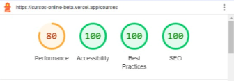
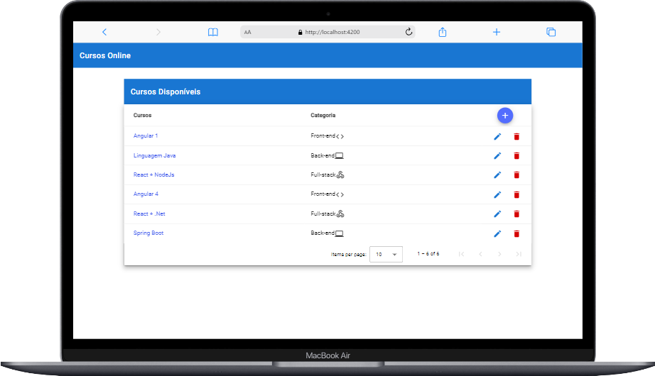
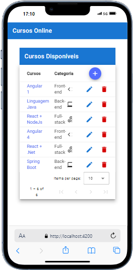
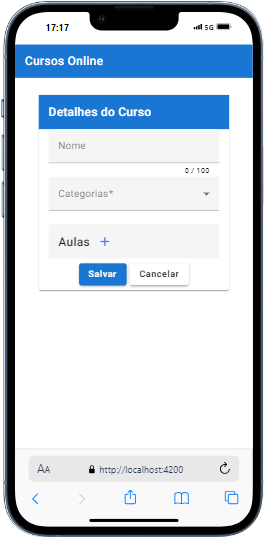
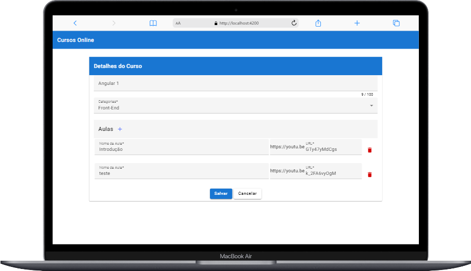
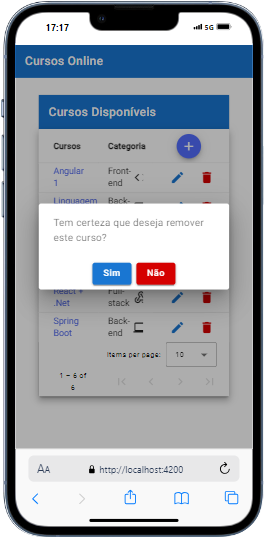
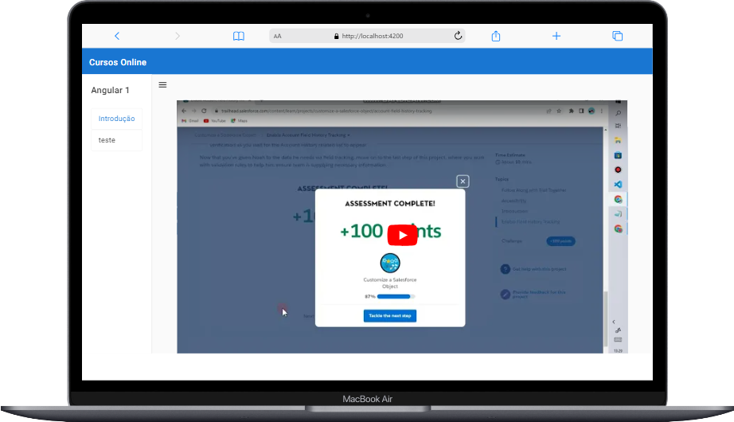
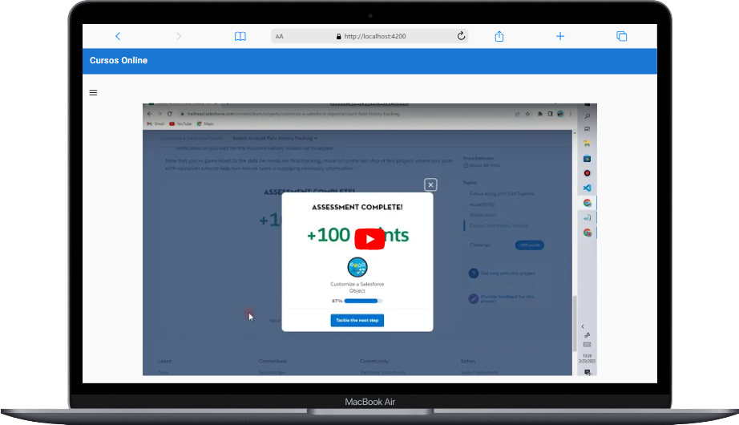

# Front-End em Angular para um Sistema de Cursos Online

## 📄 Descrição
Projeto para a criação da interface de um site de cursos, com o Framework Angular v.18. Nele o usuário tem a opção de realizar as opções de CRUD (leitura, criação, atualização e remoção de registros). Para a construção da interface visual estão sendo utilizados os recursos do Angular Material. O projeto também conta com a integração da API do YouTube e com uma atenção especial às métricas concernentes à Performance, Acessibilidade, Melhores Práticas e SEO.

## 👤 Integrante
- Ermeson José Ribeiro
  ( [github](https://github.com/Ermeson23) | [linkedin](linkedin.com/in/ermeson-ribeiro-a29121212/) )

## 🚀 Tecnologias

- HTML e HTML5
- SCSS
- TypeScript
- Angular
- [Angular Material para componentes de UI](https://material.angular.io/)

## ⌨️ Editor / IDE

- Visual Studio Code

## 🖇️ Funcionalidades disponíveis

- ✅ Lista de todos os cursos com paginação
- ✅ Lista de todas as aulas por curso
- ✅ Formulários para criar e atualizar cursos e aulas (Relacionamento um para muitos)
- ✅ Componente de diálogo Modal para a Exclusão de Cursos
- ✅ Componente de diálogo Modal para apresentar um erro, caso a API não esteja disponível.
- ✅ Tela de Visualização das aulas com a Integração da API do Youtube

## Captura das Métricas da Aplicação Fornecidas pelo LightHouse

<p align="center" id="lighthouse">
  
</p>

## Capturas de Telas da Aplicação

Página Inicial - Lista de cursos com paginação

<p align="center">
  
</p>

Página Inicial - Lista de cursos com paginação - Mobile

<p align="center">
  
</p>

Página de Criação de Cursos - Desktop

<p align="center">
  
</p>

Página de Criação de Cursos - Mobile

<p align="center">
  
</p>

Página de Edição de Cursos - Desktop

<p align="center">
  
</p>

Página de Exclusão de Cursos - Mobile

<p align="center">
  
</p>

Página para a Visualização de Aulas

<p align="center">
  
</p>

<p align="center">
  
</p>

## 💻 Detalhes do Projeto e Dependências externas
- Angular v.18
- Componentes Standalone
- Gerenciador de Pacotes: NPM
- Integração com a API do YouTube
- Conventional Commits
- LightHouse para mensurar a adequação da página com relação às métricas: Performance, Acessibilidade, Melhores Práticas e SEO
- [Adobe Color](https://color.adobe.com/pt/create/color-contrast-analyzer) - Para assegurar o contraste suficiente entre as cores de fontes e de back-ground da aplicação

## ⚙️ Instalação do projeto

Passo-a-passo:
1. Entre no cmd/terminal.
2. Navegue para o diretório de sua preferência.
3. Clone o repositório com o seguinte comando:
```[
https://github.com/Ermeson23/crud-angular-front.git]
```
## ❗️ Executando o código localmente

Você precisa ter o Node.js / NPM instalado localmente.

1. Instale todas as dependências necessárias:

```
npm install
```

2. Execute o projeto:

```
npm run start
```

Este comando executará o projeto Angular com um proxy para o servidor Java, sem exigir CORS.

Abra seu navegador e acesse **http://localhost:4200** (porta padrão do Angular).